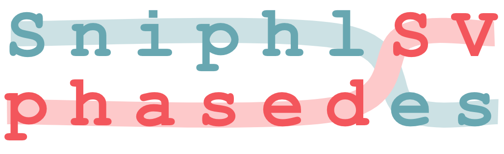
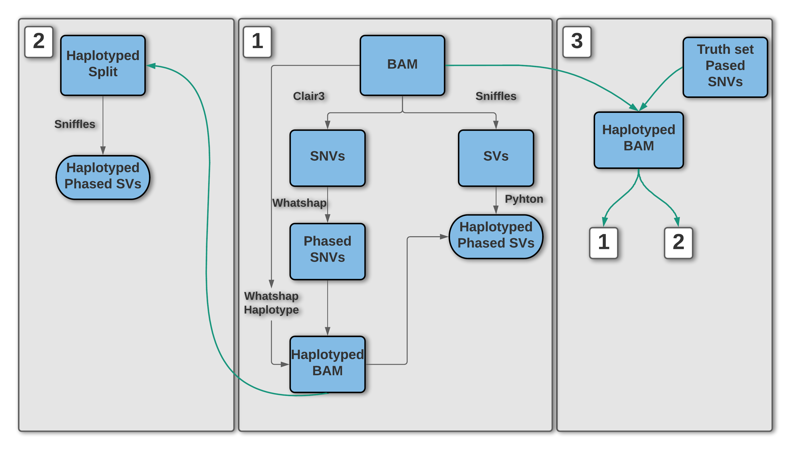

# Main idea



## Please cite our work -- here is the ICMJE Standard Citation:

### ...and a link to the DOI:

### You can make a free DOI with zenodo <link>

## Website (if applicable)

## Introduction

Phasing infers the correct cis or trans relationship between differing chromosomal loci allowing for haplotype reconstruction. Protocols and programs utilizing molecular phasing (chromosomal separation at the bench before sequencing), pedigree-based phasing (matching parental and offspring genotypes to understand the haplotype), population-based phasing (using genotype data from large cohorts to infer haplotypes), and read-based phasing (mapping sequencing reads with the same variants to construct a haplotype) are all successful approaches to phasing next generation sequencing data. The long reads of 3rd generation sequencing has bolstered our ability to phase longer and more comprehensive haplotype blocks. More comprehensive haplotype blocks increase our ability to accurately phase structural variants.

The goal of this project is to integrate a program with the Sniffles SV caller to properly phase structural variants and augment the ability of Sniffles to accurately call SVs. While tools such as WhatsHap and LongShot focus on phasing SNVs in PacBio and ONT long-read data, Sniphles focuses on phasing SVs.  

# What is <this software>?

Overview Diagram

# Software Workflow Diagram


We used Princess (ref) to align, detect and phase SNVs and SVs from PacBio HiFi reads. The produced Bam from the previous step is the input for Sniphles, where pysam  version xx (ref) was used for alignment.   For each phase block we used the mosdepth version xx (ref) to detect coverage. Later, we called SVs using Sniffles version xx (ref) with the adequate numbers of reads to support SV. The identified SVs per phase block were sorted and concatenated using bcftools version xx (ref), and both the haplotypes were merged using SURVIVOR version xx (ref).

Sniphles is implemented in Python 3, it takes a haplotype Bam file as input and produces a phased and haplotypes SV file. The workflow starts with looping through the reads in the bam file and splitting them into groups based on the phasing blocks, which enables parallel analysis  of the data. The read coverage is calculated for each bam file and used to estimate the parameters for calling SVs by Sniffles.  Next, the identified SV per haplotype will be concatenated using bcftools and later both the haplotypes will be merged using SURVIVOR.

# How to use <this software>

_Simply:_
`sinphles -b foo.bam -v output.vcf -n sample_name`

```
usage: sniphles.py [-h] -b BAM -v VCF [-l LOG_FILE] [-s MINIMUM_SUPORT_READ] -n NAME

Use Sniffles on a phased bam to get phased SV calls

optional arguments:
  -h, --help            show this help message and exit
  -b BAM, --bam BAM     Phased bam to perform phased SV calling on (default: None)
  -v VCF, --vcf VCF     output VCF file (default: None)
  -l LOG_FILE, --log LOG_FILE
                        Log file (default: sniphles.log)
  -s MINIMUM_SUPORT_READ, --minimum_suport_read MINIMUM_SUPORT_READ
                        Minimum support read to call SV equals to -s in sniffles (default: 4)
  -n NAME, --name NAME  Sample name of output VCF (default: None)
```

# Sniphles

Sniples: Using Sniffles - but phased
- Start from a BAM with phase per read annotated (e.g. from WhatsHap, LongShot)
- Identify phase blocks and split in monophasic (homozygous), diphasic (heterozygous) and unphased blocks
- Loop over haplotype blogs, split BAM using temporary files and make phased bams => good opportunity for massive parallelization
- run sniffles
- filtering
- concatenating the parts
- merging haplotypes back together using SURVIVOR and force-calling Sniffles

BONUS:
- can handle cram input (Sniffles CAN'T)
- will output a correctly SORTED VCF (Sniffles doesn't care)


# File structure diagram
#### _Define paths, variable names, etc_

# Installation options:

### Installing <this software> from Github using Anaconda3.

Due to dependencies the easiest way to install is using Anaconda3.

1. `git clone https://github.com/collaborativebioinformatics/Sniphles.git`
2. `cd <repository-folder-path>`
3. `conda env create -f env/sniphles.yml`
4. `conda activate sniphles`

Alternatively make sure to have the following packages installed:

  - Python >= 3.6
  - pysam
  - numpy
  - [cyvcf2](https://github.com/brentp/cyvcf2)
  - [mosdepth](https://github.com/brentp/mosdepth)
  - [sniffles](https://github.com/fritzsedlazeck/Sniffles)
  - [bcftools](http://samtools.github.io/bcftools/bcftools.html)
  - [survivor](https://github.com/fritzsedlazeck/SURVIVOR)

# Testing

Python unittests are enabled, run:

```shell script
python -m unittest
```

# Additional Functionality

### DockerFile

<this software> comes with a Dockerfile which can be used to build the Docker image.

  1. `git clone https://github.com/NCBI-Hackathons/<this software>.git`
  2. `cd server`
  3. `docker build --rm -t <this software>/<this software> .`
  4. `docker run -t -i <this software>/<this software>`

### Website

There is also a Docker image for hosting the main website. This should only be used for debug purposes.

  1. `git clone https://github.com/NCBI-Hackathons/<this software>.git`
  2. `cd Website`
  3. `docker build --rm -t <this software>/website .`
  4. `docker run -t -i <this software>/website`
